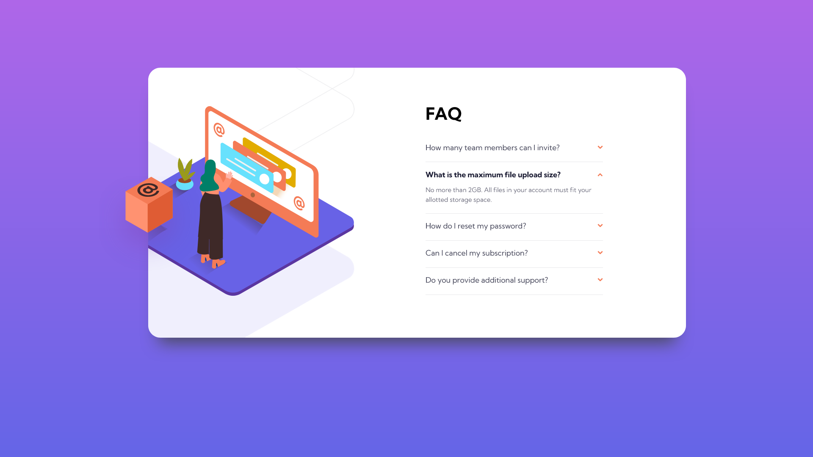

# Frontend Mentor - FAQ accordion card solution

This is a solution to the [FAQ accordion card challenge on Frontend Mentor](https://www.frontendmentor.io/challenges/faq-accordion-card-XlyjD0Oam). Frontend Mentor challenges help you improve your coding skills by building realistic projects. 

## Table of contents

- [Overview](#overview)
  - [The challenge](#the-challenge)
  - [Screenshot](#screenshot)
  - [Links](#links)
- [My process](#my-process)
  - [Built with](#built-with)
  - [What I learned](#what-i-learned)
  - [Continued development](#continued-development)
  - [Useful resources](#useful-resources)
- [Author](#author)
- [Acknowledgments](#acknowledgments)

**Note: Delete this note and update the table of contents based on what sections you keep.**

## Overview

### The challenge

Users should be able to:

- View the optimal layout for the component depending on their device's screen size
- See hover states for all interactive elements on the page
- Hide/Show the answer to a question when the question is clicked

### Screenshot

### Links

- Solution URL: [https://www.frontendmentor.io/solutions/using-react-with-vanilla-css-aQ8VuTrfcq](https://www.frontendmentor.io/solutions/using-react-with-vanilla-css-aQ8VuTrfcq)
- Live Site URL: [https://akaigyouhou.github.io/frontend-mentor-faq-accordion-card-main/](https://akaigyouhou.github.io/frontend-mentor-faq-accordion-card-main/)

## My process

### Built with

- Semantic HTML5 markup
- CSS custom properties
- Flexbox
- Mobile-first workflow
- [React](https://reactjs.org/) - JS library

### Continued development

I find it's really hard to adjust the layout from mobile to desktop version. I try to use flex, but at last I just wrote down some margin to make it match the design.

## Author

- Frontend Mentor - [@akaigyouhou](https://www.frontendmentor.io/profile/yourusername)
- Twitter - [@akaigyouhou](https://www.twitter.com/yourusername)
